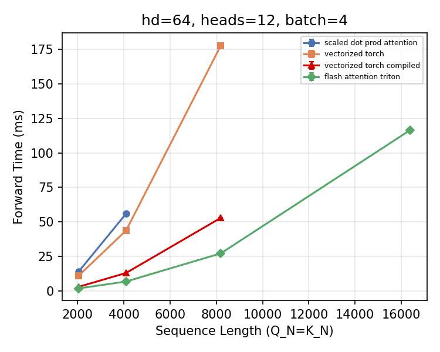
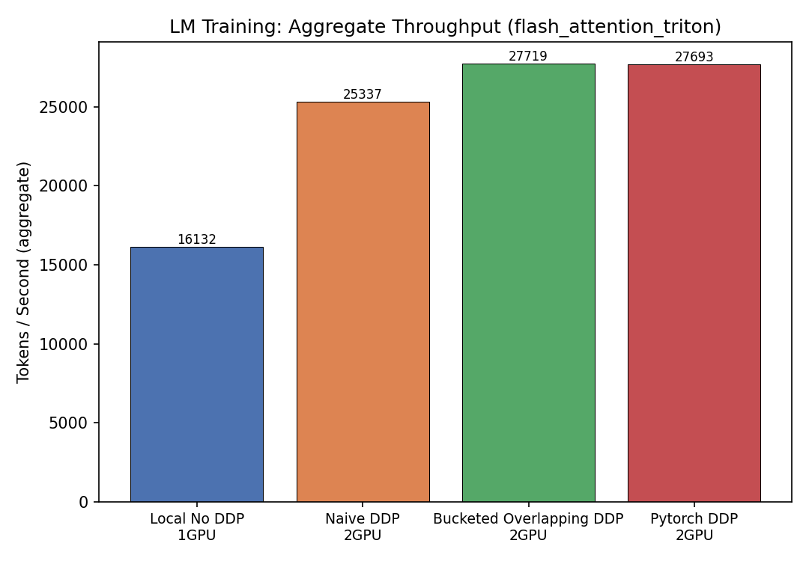

# llm-stack

A from-scratch LLM stack: **train** a Transformer with custom GPU kernels and distributed
training, then **serve** it through a hand-built inference engine.

Both halves are written from the ground up — the attention kernel, the gradient
synchronization, the tokenizer, the serving loop. Nothing here calls `model.generate()`
or `torch.nn.parallel.DistributedDataParallel` to do the interesting part.

| | |
|---|---|
| [`training/`](training/) | Transformer LM + Triton FlashAttention kernel + custom bucketed/overlapped DDP |
| [`serving/`](serving/) | Async inference engine (`inferenceLM/`): request pipeline, engine lifecycle, KV-cache decode |

---

## Headline results

All training benchmarks below were run on a rented **2× RTX 3090** instance
(dual Xeon E5-2680 v4, 193 GB RAM). Every number links to the artifact it came from.

### 1. Triton FlashAttention — 6.54× faster, and the only kernel that survives long context

At `head_dim=64, heads=12, batch=4`:

| Sequence length | Vectorized PyTorch | **Triton FlashAttention** | Speedup |
|---:|---:|---:|---:|
| 8,192 | 177.82 ms | **27.20 ms** | **6.54×** |
| 16,384 | OOM | **116.60 ms** | — |

At 16,384 tokens every baseline kernel runs out of memory. The Triton kernel completes,
because it never materializes the `N×N` attention matrix — it tiles the computation and
keeps only the running softmax statistics in SRAM.



*Source: [`training/artifacts/attention_sweep_forward.png`](training/artifacts/attention_sweep_forward.png),
generated by [`benchmark_attention_sweep.py`](training/cs336_systems/experiments/benchmark_attention_sweep.py).*

### 2. Custom bucketed + overlapped DDP — matches PyTorch's official implementation

Gradient all-reduce is grouped into size-bounded buckets and overlapped with the backward
pass, so communication happens while the next layer's gradients are still being computed
instead of after all of them are done.

| Strategy | GPUs | tok/s | Scaling efficiency | Peak memory overhead |
|---|---:|---:|---:|---:|
| Local, no DDP | 1 | 16,132.4 | — | — |
| Naive DDP (per-parameter all-reduce) | 2 | 25,336.7 | 78.5% | −3.3 MB |
| **Bucketed + Overlapped DDP (mine)** | 2 | **27,719.1** | **85.9%** | +498.8 MB (+3.3%) |
| PyTorch official `DistributedDataParallel` | 2 | 27,692.6 | 85.8% | +489.5 MB (+3.2%) |

Two things worth reading off this table:

- **+9.4% over the naive baseline** (25,336.7 → 27,719.1 tok/s) for +3.3% peak memory.
  That is the overlap paying for itself.
- **It matches PyTorch's official DDP** (27,719.1 vs 27,692.6 tok/s — a 0.1% gap, which is
  within run-to-run noise). Matching the reference implementation is the point; the two
  are not meaningfully different, and I would not claim to have beaten it.



*Source: [`training/artifacts/lm_matrix_table_flash_attention_triton.png`](training/artifacts/lm_matrix_table_flash_attention_triton.png),
generated by [`benchmark_lm_matrix.py`](training/cs336_systems/experiments/benchmark_lm_matrix.py).
The implementation that produced these numbers is `DDPOverlapBucketed` in
[`FlashDDP.py`](training/cs336_systems/Parallelization/FlashDDP/FlashDDP.py).*

### 3. KV-cache decode, gated on exact correctness

`TransformerLM.forward_with_cache()` is an inference-only path added alongside the
untouched training `forward()`. It has two invariants that are easy to get wrong and are
enforced by tests rather than by comment:

- decode must pass `is_causal=False` — the causal mask is built as `tril(seq_q, seq_k)`,
  which for a single query row would expose only key 0
- RoPE must be applied at **absolute** positions *before* keys enter the cache

[`kv_cache_gate.py`](training/cs336_systems/experiments/kv_cache_gate.py) is a hard gate:
cached decode must be **token-identical** to full recompute before any cached performance
number is allowed to be reported.

---

## The serving engine

`serving/inferenceLM/` is a hand-written inference server built in weekly increments.
What exists today:

```
submit_request()  ──►  asyncio.Queue  ──►  InferenceEngine loop  ──►  request_store
   tokenize                                  prefill → decode          status + tokens
```

- **Async request pipeline** — `RequestReceiver` tokenizes and enqueues; the engine
  consumes off a shared `asyncio.Queue`; results land in a `request_store` keyed by
  request id.
- **Engine lifecycle state machine** — `INIT → RUNNING → DRAINING → STOPPED` with
  `async shutdown(drain=True|False)`. `drain=True` pushes a sentinel and lets in-flight
  work finish; `drain=False` cancels it. This exists because a naive `kill()` flag can
  never unblock a consumer parked on `await queue.get()` — nothing polls that flag, so the
  engine hangs forever. The sentinel and the cancel are the two ways to actually wake it.
- **Manual prefill/decode loop** — `LMEngine` drives the model by hand rather than calling
  `.generate()`, which is what makes per-step scheduling possible at all.

**Not yet built (honest status):** the engine advances **one request at a time to
completion**. Batch size is 1. Continuous batching — interleaving in-flight requests and
folding their decode steps into a single forward pass — is the work in progress, tracked
as LMS-7 through LMS-9.

---

## Roadmap

| | Status |
|---|---|
| Engine lifecycle state machine + graceful drain | ✅ done |
| Request / iteration lifecycle split (interleave in-flight requests) | 🔜 in progress |
| Batched decode (multiple requests, one forward pass) | ⬜ planned |
| Block-based (paged) KV cache — block table + free list | ⬜ planned |
| Ragged attention forward — no padding, gather by block table | ⬜ planned |

---

## Reproduce

```bash
uv sync
source .venv/bin/activate
```

```bash
# Attention kernel sweep (sequence length scaling + latency)
uv run python training/cs336_systems/experiments/benchmark_attention_sweep.py
```

```bash
# Kernel x DDP-strategy matrix, emits CSV + PNG into artifacts/
uv run python training/cs336_systems/experiments/benchmark_lm_matrix.py \
  --config training/cs336_systems/experiments/default_pipeline_config.json \
  --train_path data/tokenized/ts_train.npy \
  --val_path   data/tokenized/ts_valid.npy \
  --timed_epochs 3 \
  --kernels flash_attention_triton \
  --wrappers "Local No DDP" "Naive DDP" "Pytorch DDP" "Bucketed Overlapping DDP"
```

```bash
# Serving path: TTFT, decode p50/p90, tokens/s -- recompute vs KV cache
uv run python training/cs336_systems/experiments/bench_serving.py \
  --config training/cs336_systems/experiments/default_pipeline_config.json \
  --checkpoint <path-to-checkpoint.pt> \
  --modes recompute cache
```

The DDP and attention benchmarks need 2× CUDA GPUs and a Triton install; the serving
benchmark runs on CPU or MPS.

---

## Navigating this repo

[`START_HERE.md`](START_HERE.md) is the module index — which file holds what, and
**which documents are current versus superseded**. Read it before trusting any design doc.

## Coursework attribution

The training half extends **Stanford CS336** assignment scaffolding with my own systems
implementation and benchmarking workflow. Original handouts are kept under
[`training/`](training/).
