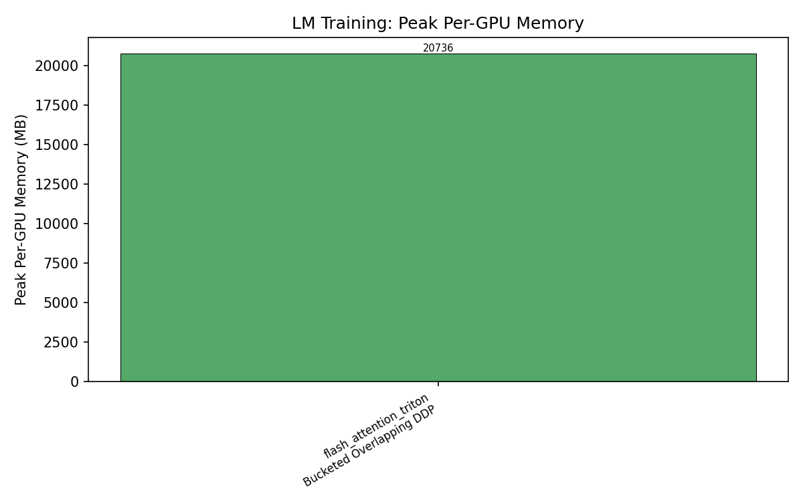
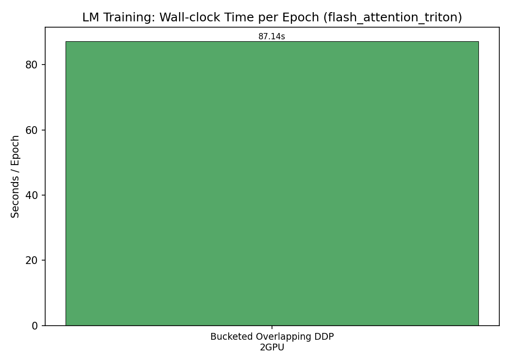
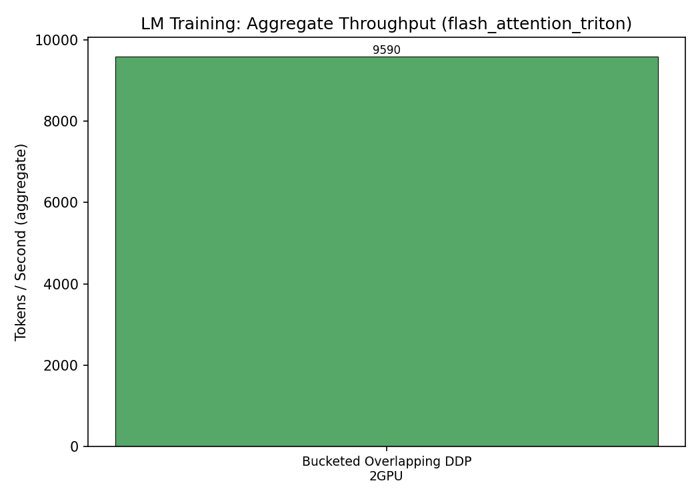
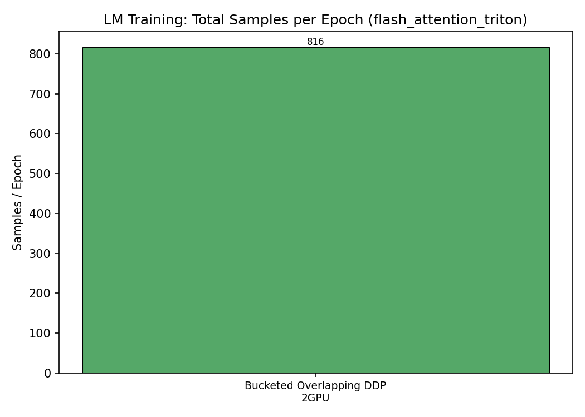
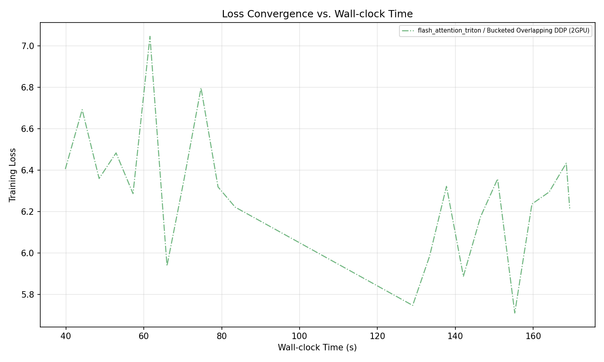

# LM Training Benchmark Matrix

## Design

- **Local batch size** is the **same** across single-GPU and DDP.
- **Steps per epoch** is identical for all configurations.
- DDP therefore processes `world_size ×` more samples per epoch in roughly the same wall-clock time.
- Memory is reported **per-GPU** (worst-case across ranks).

## Results

| Kernel | DDP | GPUs | Epochs | Steps/ep | Global BS | Local BS | Samples/ep | Wall (s) | s/ep | tok/s | Peak GPU MB |
|--------|-----|------|--------|----------|-----------|----------|------------|----------|------|-------|-------------|
| flash_attention_triton | Bucketed Overlapping DDP | 2 | 2 | 51 | 16 | 8 | 816 | 174.271 | 87.136 | 9589.5 | 20735.7 |

## Charts

### flash_attention_triton

