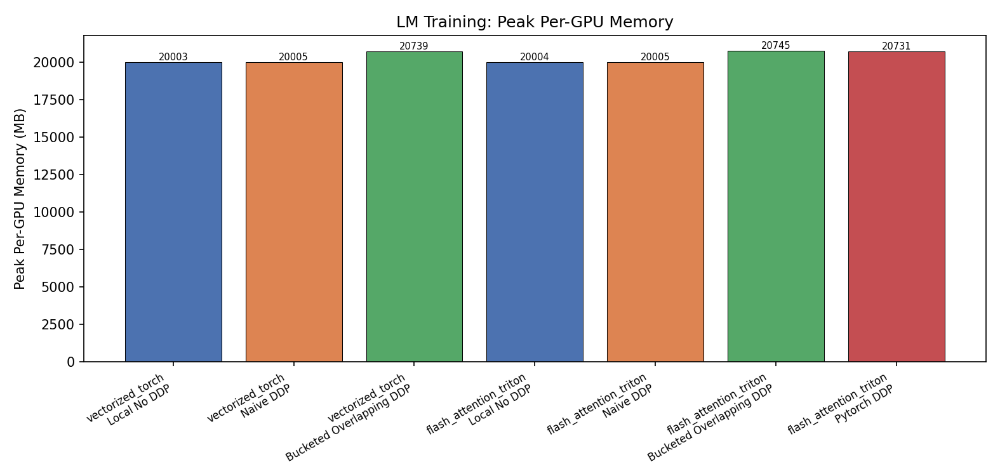
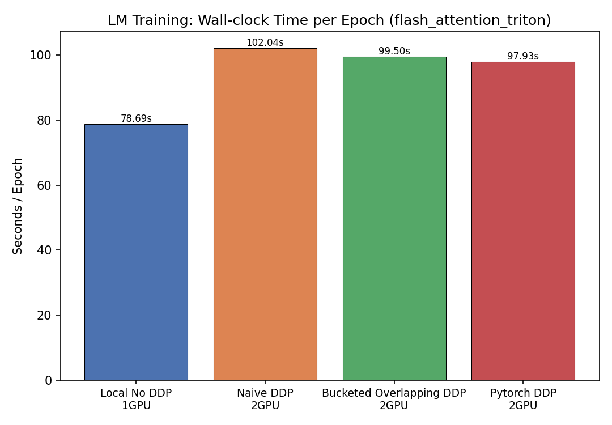
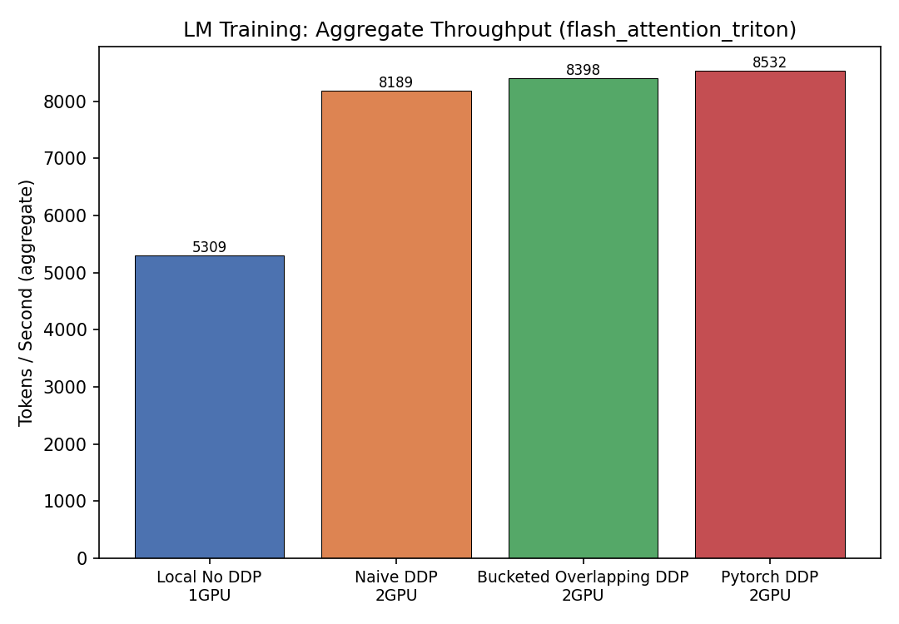
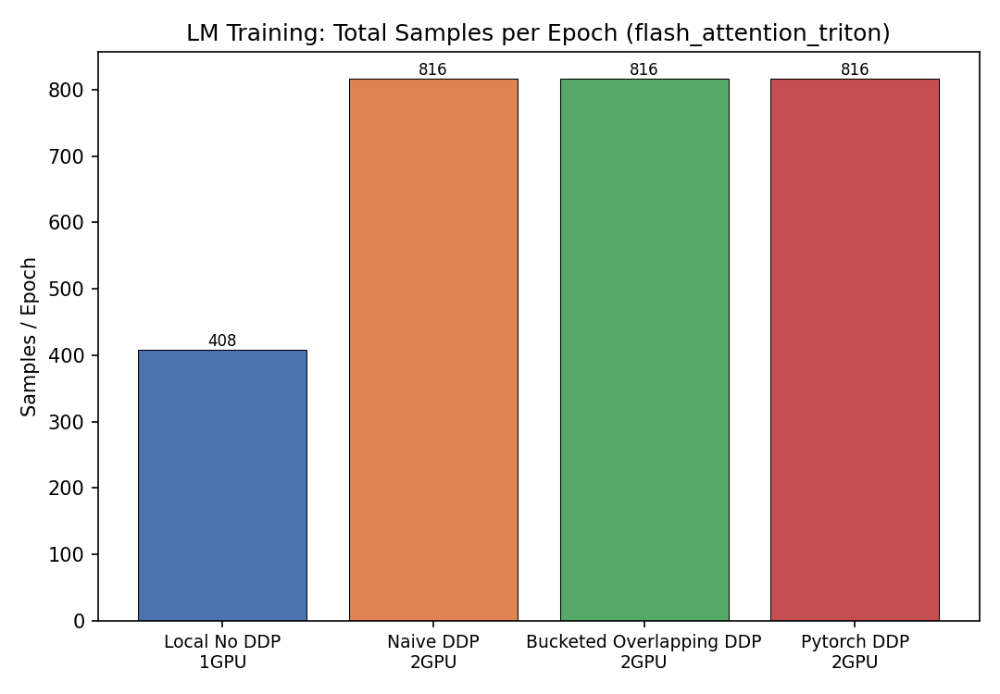
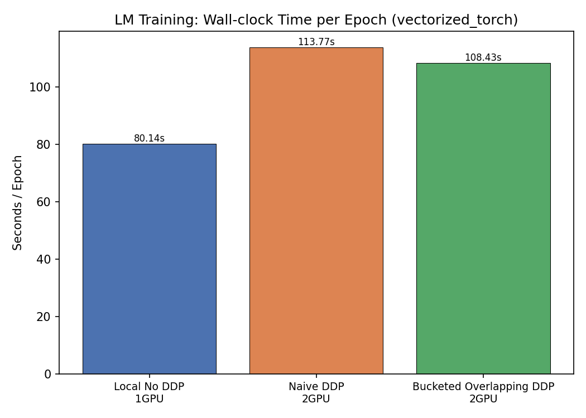
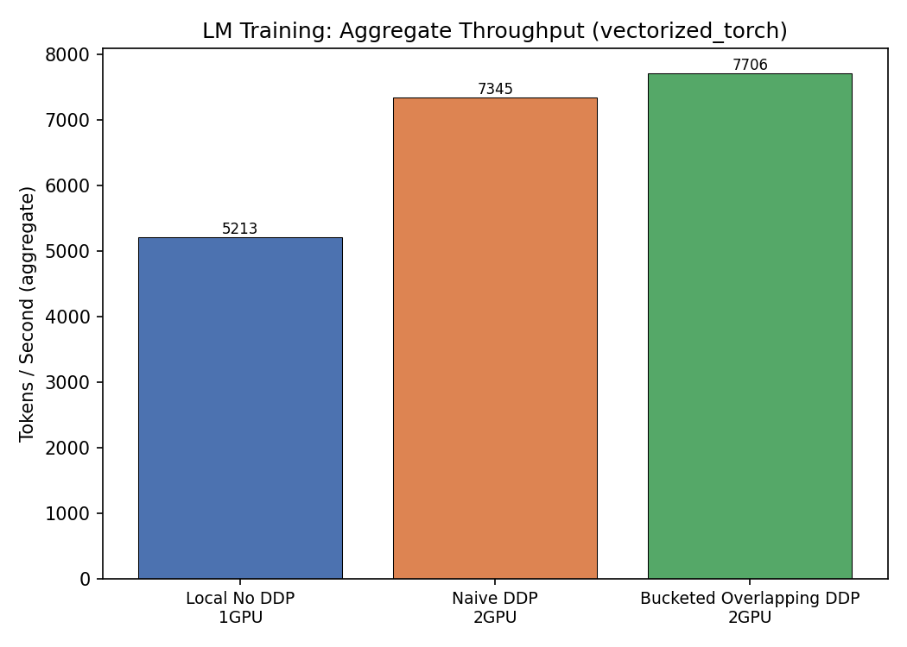
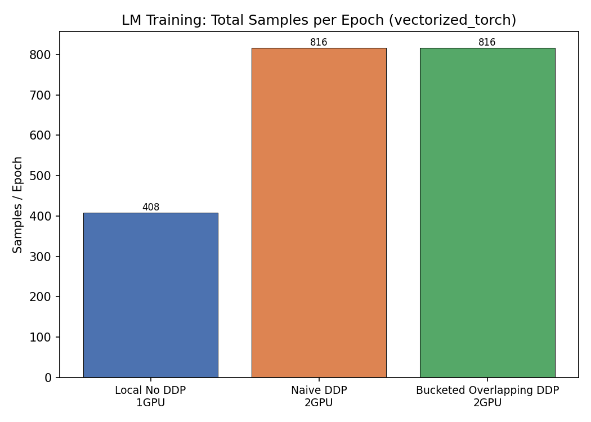
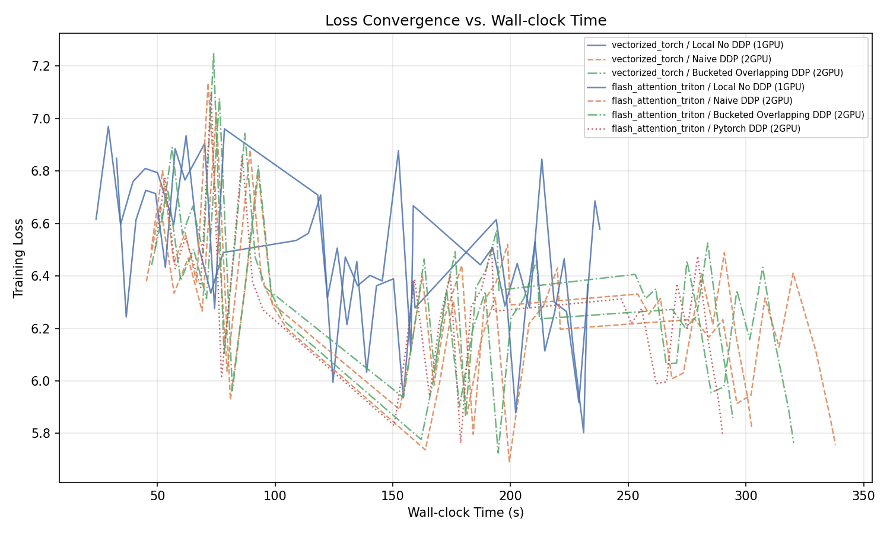

# LM Training Benchmark Matrix

## Design

- **Local batch size** is the **same** across single-GPU and DDP.
- **Steps per epoch** is identical for all configurations.
- DDP therefore processes `world_size ×` more samples per epoch in roughly the same wall-clock time.
- Memory is reported **per-GPU** (worst-case across ranks).

## Results

| Kernel | DDP | GPUs | Epochs | Steps/ep | Global BS | Local BS | Samples/ep | Wall (s) | s/ep | tok/s | Peak GPU MB |
|--------|-----|------|--------|----------|-----------|----------|------------|----------|------|-------|-------------|
| scaled_dot_prod_attention | Local No DDP | 0 | 3 | 51 | 8 | 0 | 0 | 0 | 0 | 0 | 0 |
| scaled_dot_prod_attention | Naive DDP | 0 | 3 | 51 | 8 | 0 | 0 | 0 | 0 | 0 | 0 |
| scaled_dot_prod_attention | Bucketed Overlapping DDP | 0 | 3 | 51 | 8 | 0 | 0 | 0 | 0 | 0 | 0 |
| scaled_dot_prod_attention | Pytorch DDP | 0 | 3 | 51 | 8 | 0 | 0 | 0 | 0 | 0 | 0 |
| vectorized_torch | Local No DDP | 1 | 3 | 51 | 8 | 8 | 408 | 240.417 | 80.139 | 5213.3 | 20003.3 |
| vectorized_torch | Naive DDP | 2 | 3 | 51 | 16 | 8 | 816 | 341.302 | 113.767 | 7344.7 | 20005.0 |
| vectorized_torch | Bucketed Overlapping DDP | 2 | 3 | 51 | 16 | 8 | 816 | 325.285 | 108.428 | 7706.3 | 20739.3 |
| vectorized_torch | Pytorch DDP | 0 | 3 | 51 | 8 | 0 | 0 | 0 | 0 | 0 | 0 |
| flash_attention_triton | Local No DDP | 1 | 3 | 51 | 8 | 8 | 408 | 236.075 | 78.692 | 5309.2 | 20003.9 |
| flash_attention_triton | Naive DDP | 2 | 3 | 51 | 16 | 8 | 816 | 306.124 | 102.041 | 8188.7 | 20004.7 |
| flash_attention_triton | Bucketed Overlapping DDP | 2 | 3 | 51 | 16 | 8 | 816 | 298.494 | 99.498 | 8398.0 | 20745.0 |
| flash_attention_triton | Pytorch DDP | 2 | 3 | 51 | 16 | 8 | 816 | 293.797 | 97.932 | 8532.3 | 20731.4 |

## Charts

### flash_attention_triton

### vectorized_torch

